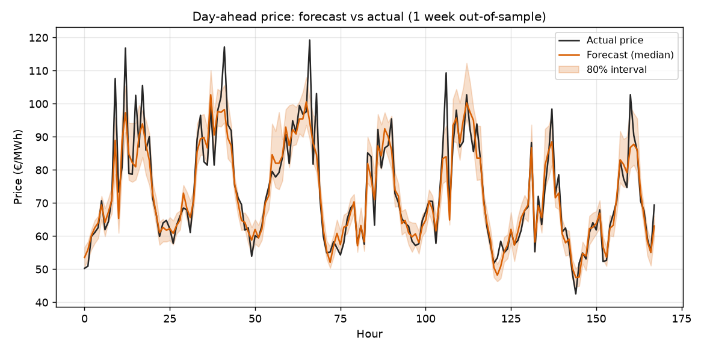
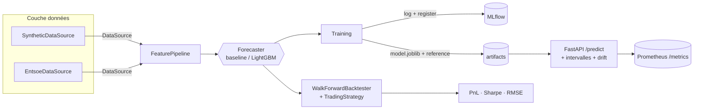
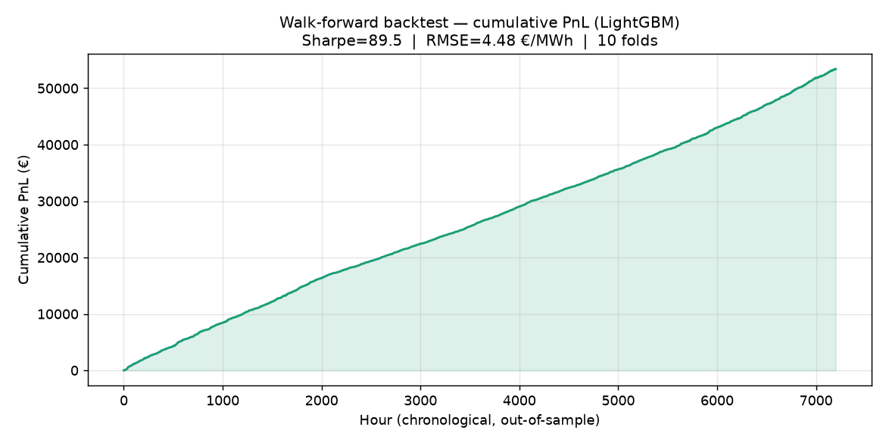

# Day-ahead power price forecaster

Prévision du prix horaire de l'électricité sur le marché *day-ahead*, avec un backtest de stratégie de trading, et toute la partie mise en production autour (API, Docker, MLflow, CI, monitoring).

Le but du projet : prendre un modèle ML (LightGBM) et le sortir du notebook pour en faire un service qui tient debout en prod. Le cas d'usage (prévoir le prix du lendemain, prendre une position, mesurer le PnL et le risque) correspond au métier des équipes de trading / Global Energy Management.



Prévision LightGBM (orange) vs prix réel (noir) sur une semaine hors échantillon, avec l'intervalle de confiance à 80 %. La bande donne une idée du risque.

## Architecture

Le code est découpé en couches. Chaque couche parle à une interface, pas à une implémentation concrète — c'est ce qui permet par exemple de remplacer les données synthétiques par les vraies données ENTSO-E sans rien changer ailleurs.



```
src/power_forecaster/
├── data/            # d'où viennent les données
│   ├── base.py          DataSource (interface + validation du schéma)
│   ├── synthetic.py     générateur hors-ligne déterministe (pour la CI)
│   └── entsoe.py        adaptateur vraies données ENTSO-E
├── features/        # feature engineering
│   ├── base.py          FeatureTransformer + FeaturePipeline
│   └── transformers.py  calendrier, lags, rolling, fondamentaux
├── models/
│   ├── base.py          Forecaster + Prediction (médiane + intervalle)
│   ├── baseline.py      seasonal-naive (la référence à battre)
│   ├── gbm.py           LightGBM quantile
│   └── __init__.py      registry + create_model()
├── backtest/
│   ├── engine.py        WalkForwardBacktester
│   ├── strategy.py      TradingStrategy (directionnelle / confidence-gated)
│   └── metrics.py       RMSE, sMAPE, pinball, Sharpe, max drawdown
├── training/
│   └── train.py         data → features → backtest → fit → log MLflow
├── serving/
│   ├── api.py           FastAPI (/predict, /health, /ready, /metrics)
│   ├── schemas.py       schémas Pydantic
│   └── predictor.py     chargement modèle + features au serving
├── monitoring.py    # détection de drift (PSI)
├── config.py        # config typée (pydantic-settings)
└── cli.py           # ppf train / backtest / serve
```

Concrètement, `DataSource`, `Forecaster` et `TradingStrategy` sont des classes abstraites. Il y a deux sources de données (`SyntheticDataSource` pour développer/tester, `EntsoeDataSource` pour les vraies données) : on passe de l'une à l'autre avec une variable d'env (`PPF_DATA_SOURCE=entsoe`). Même principe pour les modèles et les stratégies, ce qui permet de les comparer sans toucher au moteur de backtest.

## Démarrage rapide

```bash
# installer (Python 3.11+)
make install            # ou: pip install -e ".[dev]"

# entraîner + backtester + logger dans MLflow
make train              # ou: ppf train --model lightgbm

# comparer le modèle à la baseline
ppf backtest --model lightgbm

# lancer l'API
make serve              # http://localhost:8000/docs

# tester l'API
ppf sample-request > req.json
curl -X POST localhost:8000/predict -H "Content-Type: application/json" -d @req.json
```

Tout lancer avec Docker (API + serveur MLflow) :

```bash
docker compose up --build
# API     → http://localhost:8000/docs
# MLflow  → http://localhost:5000
```

## Résultats du backtest

Évaluation walk-forward (chronologique, sans fuite), LightGBM vs baseline seasonal-naive sur données synthétiques :

| Modèle | RMSE (€/MWh) | sMAPE | PnL total | Sharpe |
|---|---|---|---|---|
| LightGBM | ≈ 4.5 | ≈ 5 % | positif | élevé |
| Seasonal-naive | ≈ 10.8 | ≈ 14 % | ≈ 0 | 0 |

La baseline ne fait aucun PnL : sa prévision est égale au prix de référence, donc la stratégie ne voit aucun edge. Ça illustre pourquoi un vrai modèle apporte quelque chose.



Pour régénérer les figures : `python scripts/plot_backtest.py`

## L'API

| Route | Description |
|---|---|
| `POST /predict` | prévision horaire avec intervalle + indicateur de drift |
| `GET /health` | liveness probe |
| `GET /ready` | readiness probe (modèle chargé) |
| `GET /metrics` | métriques Prometheus |
| `GET /docs` | Swagger auto-généré |

Exemple de réponse :

```json
{
  "model_name": "lightgbm",
  "predictions": [
    {"timestamp": "2024-12-31T23:00:00+00:00", "median": 58.4, "lower": 49.1, "upper": 71.8}
  ],
  "drift_psi": 0.03,
  "drift_alert": false
}
```

## Partie MLOps

- **MLflow** : chaque entraînement logge les params, les métriques (RMSE, Sharpe, PnL…), les feature importances et le modèle. Le modèle est enregistré et versionné dans le registry (rollback possible).
- **Monitoring** : à chaque requête l'API calcule le PSI entre les prix reçus et la distribution d'entraînement. Au-delà de 0,2 elle renvoie `drift_alert: true` — signal pour ré-entraîner.
- **CI** : GitHub Actions enchaîne lint (ruff) → tests + couverture → smoke-test du pipeline → build Docker.
- L'image Docker est en multi-stage et tourne en utilisateur non-root.

## Tests

```bash
make test
```

Les tests couvrent les différentes couches : schéma et déterminisme des données, absence de look-ahead dans les features, intervalles ordonnés et save/load des modèles, PnL/Sharpe du backtest, calcul du PSI, et l'API de bout en bout via le TestClient de FastAPI.

## Limites

- Les données par défaut sont synthétiques (mais avec une structure réaliste : saisonnalité, merit order, pics de prix). L'adaptateur ENTSO-E est là pour brancher de vraies données.
- Le marché de trading est volontairement simplifié (1 unité long/short vs un prix de référence) : le but est de montrer la chaîne ML → prod, pas une stratégie déployable telle quelle.
- Au serving, les stats rolling sont approximées à partir des lags fournis dans la requête (détaillé dans `predictor.py`).

---

Stack : Python 3.11, LightGBM, pandas, MLflow, FastAPI, Pydantic, Docker, pytest, GitHub Actions, ruff.
